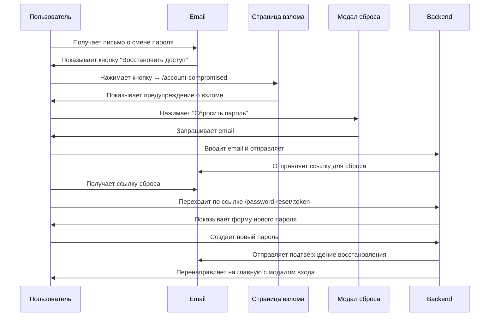

# 📋 План реализации флоу "Восстановить доступ при взломе"

## 🎯 Цель
Создать безопасный флоу восстановления доступа для пользователей, которые обнаружили несанкционированную смену пароля через email-уведомление.

---

## 🔄 User Flow (Путь пользователя)



---

## 📝 Детальный план реализации

### 1️⃣ **Frontend: Создать страницу AccountCompromisedPage**

**Файл:** `frontend/src/pages/AccountCompromisedPage/AccountCompromisedPage.tsx`

**Содержание страницы:**
```tsx
- Заголовок: "⚠️ Ваш аккаунт заблокирован в целях безопасности"
- Описание: "Мы получили сигнал о несанкционированной смене пароля"
- Список действий:
  1. Ваш пароль был изменен без вашего ведома
  2. Мы временно ограничили доступ к аккаунту
  3. Для восстановления доступа необходимо сбросить пароль
- Кнопка: "Сбросить пароль" (открывает PasswordResetModal)
- Дополнительная информация:
  - Что делать дальше
  - Как защитить аккаунт
  - Контакты поддержки
```

**Функциональность:**
- Открывает существующий `PasswordResetModal` при нажатии кнопки
- Использует существующий флоу восстановления пароля
- Красивый дизайн с предупреждающими цветами (красный/оранжевый)

---

### 2️⃣ **Frontend: CSS стили**

**Файл:** `frontend/src/pages/AccountCompromisedPage/AccountCompromisedPage.css`

**Стили:**
```css
- Центрированный контейнер
- Предупреждающая иконка (⚠️ или 🚨)
- Красно-оранжевая цветовая схема
- Карточка с тенью и границей
- Список с иконками
- Большая заметная кнопка
- Адаптивный дизайн для мобильных
```

---

### 3️⃣ **Frontend: Добавить роутинг**

**Файл:** `frontend/src/App.tsx`

**Изменения:**
```tsx
import { AccountCompromisedPage } from "./pages/AccountCompromisedPage/AccountCompromisedPage";

// В Routes добавить:
<Route path="/account-compromised" element={<AccountCompromisedPage />} />
```

---

### 4️⃣ **Backend: Обновить email-уведомление**

**Файл:** `backend/apps/users/utils.py`

**Изменения в `send_password_changed_email()`:**
```python
# Изменить ссылку "Восстановить доступ"
reset_link = f"{frontend_url}/account-compromised"  # Вместо просто "/"
```

---

### 5️⃣ **Backend: Добавить email-подтверждение после сброса**

**Файл:** `backend/apps/users/utils.py`

**Новая функция:** `send_password_reset_success_email(user)`

**Содержание письма:**
```html
Тема: ✅ Доступ к аккаунту восстановлен - SM Market

Здравствуйте, {user_name}!

Ваш пароль был успешно сброшен и доступ к аккаунту восстановлен.

📅 Дата и время: {datetime}
🌐 IP-адрес: {ip_address}

Теперь вы можете войти в аккаунт с новым паролем.

🔒 Рекомендации по безопасности:
- Используйте уникальный пароль для каждого сервиса
- Включите двухфакторную аутентификацию (если доступна)
- Не сообщайте пароль третьим лицам

Если вы не сбрасывали пароль, немедленно свяжитесь с поддержкой.

С уважением,
Команда SM Market
```

---

### 6️⃣ **Backend: Интегрировать отправку подтверждения**

**Файл:** `backend/apps/users/views.py`

**Изменения в `PasswordResetConfirmView.post()`:**
```python
def post(self, request):
    serializer = PasswordResetConfirmSerializer(data=request.data)
    serializer.is_valid(raise_exception=True)
    
    token_obj = serializer.context['token_obj']
    user = token_obj.user
    
    # Устанавливаем новый пароль
    user.set_password(serializer.validated_data['new_password'])
    user.save()
    
    # Помечаем токен как использованный
    token_obj.is_used = True
    token_obj.save()
    
    # ✨ НОВОЕ: Отправляем подтверждение восстановления
    try:
        send_password_reset_success_email(user, request)
    except Exception as e:
        print(f"Error sending password reset success email: {e}")
    
    return Response({
        'detail': 'Пароль успешно изменен. Теперь вы можете войти с новым паролем.'
    })
```

---

## 📊 Структура файлов

```
frontend/src/pages/
├── AccountCompromisedPage/
│   ├── AccountCompromisedPage.tsx    # ✨ НОВЫЙ
│   ├── AccountCompromisedPage.css    # ✨ НОВЫЙ
│   └── index.ts                      # ✨ НОВЫЙ

backend/apps/users/
├── utils.py                          # 📝 ИЗМЕНИТЬ
│   ├── send_password_changed_email() # обновить ссылку
│   └── send_password_reset_success_email() # ✨ НОВАЯ функция
└── views.py                          # 📝 ИЗМЕНИТЬ
    └── PasswordResetConfirmView.post() # добавить отправку email
```

---

## 🎨 Дизайн страницы AccountCompromisedPage

### Макет:

```
┌─────────────────────────────────────────┐
│           [Header с логотипом]          │
├─────────────────────────────────────────┤
│                                         │
│     ┌───────────────────────────┐      │
│     │    🚨 Предупреждение      │      │
│     │                           │      │
│     │  ⚠️ Ваш аккаунт           │      │
│     │  заблокирован в целях     │      │
│     │  безопасности             │      │
│     │                           │      │
│     │  Мы получили сигнал о     │      │
│     │  несанкционированной      │      │
│     │  смене пароля.            │      │
│     │                           │      │
│     │  Что произошло:           │      │
│     │  ✓ Пароль был изменен     │      │
│     │  ✓ Доступ ограничен       │      │
│     │  ✓ Требуется сброс        │      │
│     │                           │      │
│     │  [🔒 Сбросить пароль]    │      │
│     │                           │      │
│     │  Как защитить аккаунт:    │      │
│     │  • Используйте сложный    │      │
│     │    уникальный пароль      │      │
│     │  • Не делитесь паролем    │      │
│     │  • Проверьте устройства   │      │
│     │                           │      │
│     │  Нужна помощь?            │      │
│     │  support@sm-market.com    │      │
│     └───────────────────────────┘      │
│                                         │
└─────────────────────────────────────────┘
```

### Цветовая схема:
- **Фон:** `#fff3cd` (светло-желтый предупреждающий)
- **Граница:** `#ffc107` (оранжевый)
- **Заголовок:** `#dc3545` (красный)
- **Текст:** `#856404` (темно-желтый)
- **Кнопка:** `#dc3545` (красная, заметная)

---

## 🔒 Безопасность

### Что НЕ делаем:
❌ Не блокируем аккаунт автоматически (пользователь может войти со старым паролем до сброса)  
❌ Не храним информацию о "взломе" в БД (это просто информационная страница)  
❌ Не требуем дополнительной верификации (SMS, секретный вопрос) - пока  

### Что делаем:
✅ Информируем пользователя о потенциальной угрозе  
✅ Предоставляем простой способ сброса пароля  
✅ Отправляем подтверждение после успешного сброса  
✅ Даем рекомендации по безопасности  

---

## 🧪 Сценарии тестирования

### Сценарий 1: Полный флоу восстановления
1. Пользователь меняет пароль в профиле
2. Получает email с кнопкой "Восстановить доступ"
3. Нажимает кнопку → открывается `/account-compromised`
4. Видит предупреждение о взломе
5. Нажимает "Сбросить пароль" → открывается модал
6. Вводит email → получает ссылку на почту
7. Переходит по ссылке → создает новый пароль
8. Получает подтверждение на почту
9. Перенаправляется на главную с модалом входа

### Сценарий 2: Прямой переход на страницу
1. Пользователь вводит `/account-compromised` в адресной строке
2. Видит страницу с предупреждением
3. Может сбросить пароль через модал

### Сценарий 3: Ошибки
1. Email не отправился → пользователь все равно видит страницу
2. Неверный email в модале → показывается ошибка
3. Истекший токен → показывается ошибка при сбросе

---

## ✅ Чеклист реализации

### Frontend:
- [ ] Создать `AccountCompromisedPage.tsx`
- [ ] Создать `AccountCompromisedPage.css`
- [ ] Создать `index.ts` для экспорта
- [ ] Добавить роут в `App.tsx`
- [ ] Интегрировать с `PasswordResetModal`
- [ ] Протестировать открытие модала
- [ ] Проверить адаптивность на мобильных

### Backend:
- [ ] Обновить ссылку в `send_password_changed_email()`
- [ ] Создать `send_password_reset_success_email()`
- [ ] Обновить `PasswordResetConfirmView.post()`
- [ ] Добавить обработку ошибок отправки
- [ ] Протестировать отправку обоих писем

### Тестирование:
- [ ] Полный флоу от смены пароля до восстановления
- [ ] Проверка всех email-уведомлений
- [ ] Проверка UI на разных устройствах
- [ ] Проверка обработки ошибок

### Документация:
- [ ] Обновить `PASSWORD_CHANGE_EMAIL_GUIDE.md`
- [ ] Добавить скриншоты страницы
- [ ] Описать новый флоу

---

## 🚀 Будущие улучшения (опционально)

- 📱 SMS-верификация при сбросе пароля
- 🔐 Двухфакторная аутентификация (2FA)
- 📊 История входов и изменений безопасности
- 🌍 Определение геолокации по IP
- 🔔 Push-уведомления о подозрительной активности
- 🛡️ Временная блокировка аккаунта при множественных попытках взлома

---

## 📚 Связанные документы

- [PASSWORD_CHANGE_EMAIL_GUIDE.md](PASSWORD_CHANGE_EMAIL_GUIDE.md)
- [EMAIL_SETUP_GUIDE.md](EMAIL_SETUP_GUIDE.md)
- [TESTING_PASSWORD_CHANGE_EMAIL.md](TESTING_PASSWORD_CHANGE_EMAIL.md)

---

**План готов к реализации!** 🎉