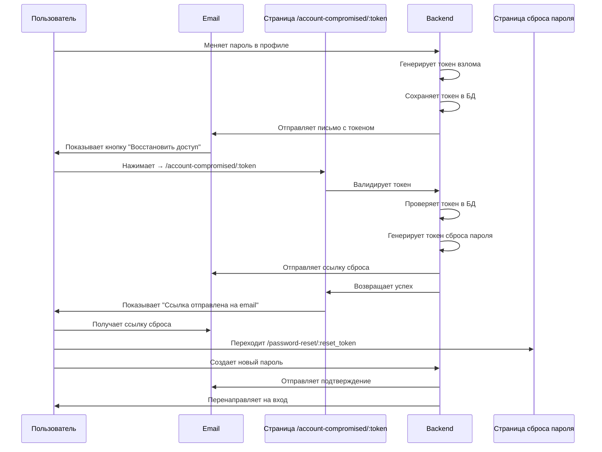

# 🔒 Безопасный флоу "Восстановить доступ при взломе" (с токеном)

## ⚠️ Проблема безопасности в первоначальном плане

**Уязвимость:** Открытая страница `/account-compromised` позволяет любому пользователю сбросить чужой пароль, просто зная email.

**Решение:** Использовать защищенную ссылку с уникальным токеном `/account-compromised/:token`

---

## 🔐 Безопасный подход

### Концепция:
1. При смене пароля генерируется **уникальный токен** (как для восстановления пароля)
2. Токен сохраняется в БД с привязкой к пользователю
3. Ссылка в email содержит этот токен: `/account-compromised/:token`
4. При переходе по ссылке токен валидируется
5. Если токен валиден → автоматически отправляется ссылка для сброса пароля на email пользователя
6. Токен можно использовать только один раз

---

## 🔄 Обновленный User Flow



---

## 📝 Детальный план реализации

### 1️⃣ **Backend: Модель для токенов взлома**

**Вариант 1: Переиспользовать существующую модель `PasswordResetToken`**

Добавить поле `token_type`:
```python
class PasswordResetToken(models.Model):
    TOKEN_TYPE_RESET = 'reset'
    TOKEN_TYPE_COMPROMISED = 'compromised'
    
    TOKEN_TYPE_CHOICES = [
        (TOKEN_TYPE_RESET, 'Password Reset'),
        (TOKEN_TYPE_COMPROMISED, 'Account Compromised'),
    ]
    
    user = models.ForeignKey(...)
    token = models.CharField(...)
    token_type = models.CharField(
        max_length=20,
        choices=TOKEN_TYPE_CHOICES,
        default=TOKEN_TYPE_RESET
    )
    created_at = models.DateTimeField(...)
    expires_at = models.DateTimeField(...)
    is_used = models.BooleanField(...)
```

**Вариант 2: Создать отдельную модель `AccountCompromisedToken`** (рекомендуется)

```python
class AccountCompromisedToken(models.Model):
    """Токен для восстановления доступа при взломе"""
    user = models.ForeignKey(
        settings.AUTH_USER_MODEL,
        on_delete=models.CASCADE,
        related_name='compromised_tokens'
    )
    token = models.CharField(max_length=100, unique=True)
    created_at = models.DateTimeField(auto_now_add=True)
    expires_at = models.DateTimeField()
    is_used = models.BooleanField(default=False)
    
    # Дополнительная информация для логирования
    ip_address = models.GenericIPAddressField(null=True, blank=True)
    user_agent = models.TextField(blank=True)
    
    @classmethod
    def generate_token(cls, user, ip_address=None, expiry_hours=24):
        token = secrets.token_urlsafe(32)
        expires_at = timezone.now() + timedelta(hours=expiry_hours)
        return cls.objects.create(
            user=user,
            token=token,
            expires_at=expires_at,
            ip_address=ip_address
        )
    
    def is_valid(self):
        return not self.is_used and timezone.now() < self.expires_at
```

---

### 2️⃣ **Backend: Обновить ChangePasswordView**

```python
class ChangePasswordView(APIView):
    def post(self, request):
        serializer = ChangePasswordSerializer(...)
        serializer.is_valid(raise_exception=True)
        
        # Устанавливаем новый пароль
        request.user.set_password(serializer.validated_data['new_password'])
        request.user.save()
        
        # Генерируем токен для восстановления доступа при взломе
        ip_address = get_client_ip(request)
        compromised_token = AccountCompromisedToken.generate_token(
            user=request.user,
            ip_address=ip_address
        )
        
        # Отправляем email с токеном
        try:
            send_password_changed_email(
                request.user, 
                request, 
                compromised_token.token  # Передаем токен
            )
        except Exception as e:
            print(f"Error sending password change email: {e}")
        
        return Response({'detail': 'Пароль успешно изменен'})
```

---

### 3️⃣ **Backend: Создать endpoint для обработки токена взлома**

**Файл:** `backend/apps/users/views.py`

```python
class AccountCompromisedView(APIView):
    """
    Обрабатывает токен взлома и автоматически отправляет 
    ссылку для сброса пароля на email пользователя
    """
    permission_classes = [AllowAny]
    
    def post(self, request):
        token = request.data.get('token')
        
        if not token:
            return Response(
                {'detail': 'Токен не предоставлен'},
                status=status.HTTP_400_BAD_REQUEST
            )
        
        try:
            # Находим токен в БД
            compromised_token = AccountCompromisedToken.objects.get(token=token)
            
            # Проверяем валидность
            if not compromised_token.is_valid():
                return Response(
                    {'detail': 'Токен недействителен или истек'},
                    status=status.HTTP_400_BAD_REQUEST
                )
            
            # Помечаем токен как использованный
            compromised_token.is_used = True
            compromised_token.save()
            
            # Генерируем токен для сброса пароля
            user = compromised_token.user
            reset_token = PasswordResetToken.generate_token(user)
            
            # Отправляем ссылку для сброса на email
            frontend_url = getattr(settings, 'FRONTEND_URL', 'http://localhost:5173')
            reset_link = f"{frontend_url}/password-reset/{reset_token.token}"
            
            # Отправляем email
            send_password_reset_link_email(user, reset_link)
            
            return Response({
                'detail': 'Ссылка для сброса пароля отправлена на ваш email',
                'email': user.email  # Показываем замаскированный email
            })
            
        except AccountCompromisedToken.DoesNotExist:
            return Response(
                {'detail': 'Недействительный токен'},
                status=status.HTTP_404_NOT_FOUND
            )
```

**Добавить в `urls.py`:**
```python
path("account-compromised/", AccountCompromisedView.as_view(), name='account-compromised'),
```

---

### 4️⃣ **Backend: Обновить функцию отправки email**

**Файл:** `backend/apps/users/utils.py`

```python
def send_password_changed_email(user, request, compromised_token):
    """
    Отправляет email-уведомление о смене пароля с защищенной ссылкой
    """
    ip_address = get_client_ip(request)
    change_datetime = timezone.now()
    formatted_datetime = change_datetime.strftime('%d.%m.%Y в %H:%M:%S UTC')
    
    # Формируем защищенную ссылку с токеном
    frontend_url = getattr(settings, 'FRONTEND_URL', 'http://localhost:5173')
    reset_link = f"{frontend_url}/account-compromised/{compromised_token}"
    
    user_name = user.get_full_name() or user.email
    
    subject = '🔒 Пароль вашего аккаунта изменен - SM Market'
    html_message = f"""
    <html>
    <body style="font-family: Arial, sans-serif; max-width: 600px; margin: 0 auto; padding: 20px;">
        <div style="background: #f8f9fa; padding: 30px; border-radius: 8px;">
            <h2 style="color: #333; margin-top: 0;">🔒 Пароль вашего аккаунта изменен</h2>
            
            <p style="font-size: 16px; color: #555;">
                Здравствуйте, <strong>{user_name}</strong>!
            </p>
            
            <p style="font-size: 16px; color: #555;">
                Ваш пароль был успешно изменен.
            </p>
            
            <div style="background: white; padding: 20px; border-radius: 5px; margin: 25px 0; border-left: 4px solid #28a745;">
                <p style="margin: 5px 0; font-size: 15px;">
                    <strong>📅 Дата и время:</strong> {formatted_datetime}
                </p>
                <p style="margin: 5px 0; font-size: 15px;">
                    <strong>🌐 IP-адрес:</strong> {ip_address}
                </p>
            </div>
            
            <div style="background: #fff3cd; padding: 20px; border-radius: 5px; border-left: 4px solid #ffc107; margin: 25px 0;">
                <p style="margin: 0 0 10px 0; font-size: 16px; font-weight: bold; color: #856404;">
                    ⚠️ Если это были не вы:
                </p>
                <p style="margin: 0 0 15px 0; font-size: 15px; color: #856404;">
                    Немедленно восстановите доступ к аккаунту, нажав на кнопку ниже.
                    Мы автоматически отправим вам ссылку для сброса пароля.
                </p>
                <a href="{reset_link}" 
                   style="display: inline-block; padding: 14px 28px; background: #dc3545; 
                          color: white; text-decoration: none; border-radius: 5px; 
                          font-weight: bold; font-size: 15px;">
                    🚨 Восстановить доступ
                </a>
                <p style="margin: 15px 0 0 0; font-size: 13px; color: #856404;">
                    Эта ссылка действительна в течение 24 часов и может быть использована только один раз.
                </p>
            </div>
            
            <p style="margin-top: 25px; color: #666; font-size: 14px; line-height: 1.6;">
                Если вы изменили пароль самостоятельно, можете проигнорировать это письмо.
                Ваш аккаунт в безопасности.
            </p>
            
            <hr style="border: none; border-top: 1px solid #ddd; margin: 25px 0;">
            
            <p style="color: #999; font-size: 13px; margin: 0;">
                С уважением,<br>
                Команда <strong>SM Market</strong>
            </p>
        </div>
    </body>
    </html>
    """
    
    plain_message = strip_tags(html_message)
    
    send_mail(
        subject,
        plain_message,
        settings.DEFAULT_FROM_EMAIL,
        [user.email],
        html_message=html_message,
        fail_silently=False,
    )


def send_password_reset_link_email(user, reset_link):
    """
    Отправляет ссылку для сброса пароля после валидации токена взлома
    """
    user_name = user.get_full_name() or user.email
    
    subject = '🔐 Ссылка для сброса пароля - SM Market'
    html_message = f"""
    <html>
    <body style="font-family: Arial, sans-serif; max-width: 600px; margin: 0 auto; padding: 20px;">
        <div style="background: #f8f9fa; padding: 30px; border-radius: 8px;">
            <h2 style="color: #333; margin-top: 0;">🔐 Сброс пароля</h2>
            
            <p style="font-size: 16px; color: #555;">
                Здравствуйте, <strong>{user_name}</strong>!
            </p>
            
            <p style="font-size: 16px; color: #555;">
                Вы запросили восстановление доступа к аккаунту после несанкционированной смены пароля.
            </p>
            
            <p style="font-size: 16px; color: #555;">
                Для создания нового пароля перейдите по ссылке:
            </p>
            
            <div style="text-align: center; margin: 30px 0;">
                <a href="{reset_link}" 
                   style="display: inline-block; padding: 14px 28px; background: #007bff; 
                          color: white; text-decoration: none; border-radius: 5px; 
                          font-weight: bold; font-size: 15px;">
                    Создать новый пароль
                </a>
            </div>
            
            <p style="font-size: 14px; color: #666;">
                Ссылка действительна в течение 24 часов.
            </p>
            
            <p style="font-size: 14px; color: #666;">
                Если вы не запрашивали сброс пароля, просто проигнорируйте это письмо.
            </p>
            
            <hr style="border: none; border-top: 1px solid #ddd; margin: 25px 0;">
            
            <p style="color: #999; font-size: 13px; margin: 0;">
                С уважением,<br>
                Команда <strong>SM Market</strong>
            </p>
        </div>
    </body>
    </html>
    """
    
    plain_message = strip_tags(html_message)
    
    send_mail(
        subject,
        plain_message,
        settings.DEFAULT_FROM_EMAIL,
        [user.email],
        html_message=html_message,
        fail_silently=False,
    )
```

---

### 5️⃣ **Frontend: Страница AccountCompromisedPage**

**Файл:** `frontend/src/pages/AccountCompromisedPage/AccountCompromisedPage.tsx`

```tsx
import { useEffect, useState } from "react";
import { useParams, useNavigate } from "react-router-dom";
import { AlertTriangle, CheckCircle, Loader } from "lucide-react";

import { authApi } from "../../api/authApi";
import { useToast } from "../../contexts/ToastContext";
import "./AccountCompromisedPage.css";

export const AccountCompromisedPage = () => {
  const { token } = useParams<{ token: string }>();
  const navigate = useNavigate();
  const { showToast } = useToast();
  
  const [loading, setLoading] = useState(true);
  const [success, setSuccess] = useState(false);
  const [error, setError] = useState("");
  const [userEmail, setUserEmail] = useState("");

  useEffect(() => {
    if (!token) {
      setError("Недействительная ссылка");
      setLoading(false);
      return;
    }

    handleTokenValidation();
  }, [token]);

  const handleTokenValidation = async () => {
    setLoading(true);
    try {
      const response = await authApi.validateCompromisedToken({ token });
      setSuccess(true);
      setUserEmail(response.data.email);
      showToast(response.data.detail, "success");
    } catch (err) {
      console.error("Error validating token:", err);
      setError("Ссылка недействительна или истекла");
      showToast("Не удалось обработать запрос", "error");
    } finally {
      setLoading(false);
    }
  };

  if (loading) {
    return (
      <div className="account-compromised-page">
        <div className="account-compromised-container">
          <Loader className="loading-spinner" size={48} />
          <p>Обработка запроса...</p>
        </div>
      </div>
    );
  }

  if (error) {
    return (
      <div className="account-compromised-page">
        <div className="account-compromised-container account-compromised-container--error">
          <AlertTriangle size={64} className="icon-error" />
          <h1>Ошибка</h1>
          <p>{error}</p>
          <button 
            className="btn-primary"
            onClick={() => navigate("/")}
          >
            Вернуться на главную
          </button>
        </div>
      </div>
    );
  }

  if (success) {
    return (
      <div className="account-compromised-page">
        <div className="account-compromised-container account-compromised-container--success">
          <CheckCircle size={64} className="icon-success" />
          <h1>Ссылка для сброса пароля отправлена</h1>
          <p>
            Мы отправили ссылку для создания нового пароля на ваш email:
          </p>
          <p className="email-display">{userEmail}</p>
          <div className="info-box">
            <h3>Что делать дальше:</h3>
            <ol>
              <li>Проверьте почтовый ящик (и папку "Спам")</li>
              <li>Перейдите по ссылке из письма</li>
              <li>Создайте новый надежный пароль</li>
              <li>Войдите в аккаунт с новым паролем</li>
            </ol>
          </div>
          <div className="security-tips">
            <h3>🔒 Рекомендации по безопасности:</h3>
            <ul>
              <li>Используйте уникальный пароль для каждого сервиса</li>
              <li>Пароль должен содержать минимум 8 символов</li>
              <li>Не сообщайте пароль третьим лицам</li>
              <li>Регулярно меняйте пароли</li>
            </ul>
          </div>
          <button 
            className="btn-secondary"
            onClick={() => navigate("/")}
          >
            Вернуться на главную
          </button>
        </div>
      </div>
    );
  }

  return null;
};
```

---

### 6️⃣ **Frontend: API метод**

**Файл:** `frontend/src/api/authApi.ts`

```typescript
validateCompromisedToken: (data: { token: string }) =>
  axios.post("/api/users/account-compromised/", data),
```

---

## 🔒 Преимущества безопасного подхода

### ✅ Что защищено:
1. **Токен уникален** - генерируется для каждой смены пароля
2. **Токен одноразовый** - можно использовать только один раз
3. **Токен временный** - истекает через 24 часа
4. **Токен привязан к пользователю** - нельзя использовать для другого аккаунта
5. **Автоматическая отправка** - ссылка сброса отправляется на email владельца
6. **Нет ввода email** - злоумышленник не может указать чужой email

### ❌ Что предотвращено:
- Массовый сброс паролей через открытую страницу
- Подбор email для сброса чужих паролей
- Повторное использование одной ссылки
- Использование устаревших ссылок

---

## 📊 Сравнение подходов

| Критерий | Небезопасный подход | Безопасный подход |
|----------|---------------------|-------------------|
| URL | `/account-compromised` | `/account-compromised/:token` |
| Доступ | Открытый для всех | Только с валидным токеном |
| Ввод email | Требуется | Не требуется |
| Защита | ❌ Нет | ✅ Токен + одноразовость |
| Уязвимость | ⚠️ Высокая | ✅ Низкая |

---

## ✅ Чеклист реализации

### Backend:
- [ ] Создать миграцию для `AccountCompromisedToken`
- [ ] Обновить `ChangePasswordView` для генерации токена
- [ ] Создать `AccountCompromisedView` для валидации токена
- [ ] Обновить `send_password_changed_email()` с токеном
- [ ] Создать `send_password_reset_link_email()`
- [ ] Добавить URL в `urls.py`
- [ ] Протестировать генерацию и валидацию токенов

### Frontend:
- [ ] Создать `AccountCompromisedPage` с обработкой токена
- [ ] Создать CSS стили
- [ ] Добавить API метод `validateCompromisedToken`
- [ ] Добавить роут в `App.tsx`
- [ ] Протестировать UI для всех состояний (loading, success, error)

### Тестирование:
- [ ] Полный флоу с валидным токеном
- [ ] Попытка использовать токен дважды
- [ ] Попытка использовать истекший токен
- [ ] Попытка использовать несуществующий токен
- [ ] Проверка всех email-уведомлений

---

**Безопасный план готов к реализации!** 🔒