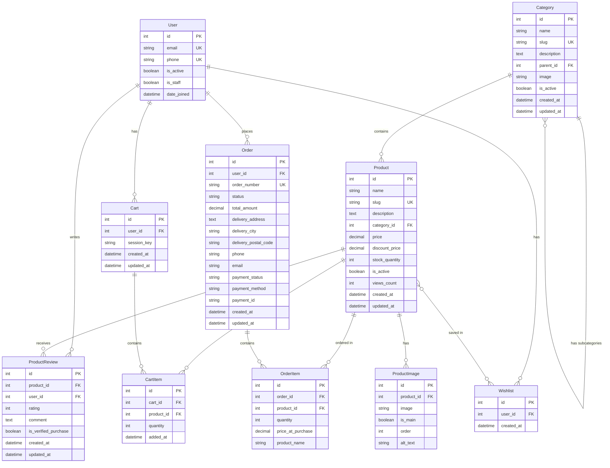
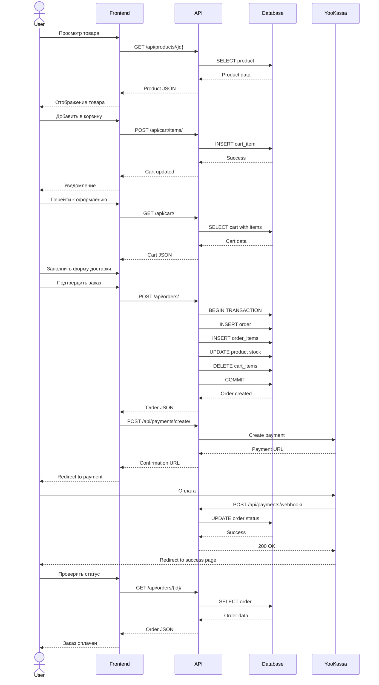
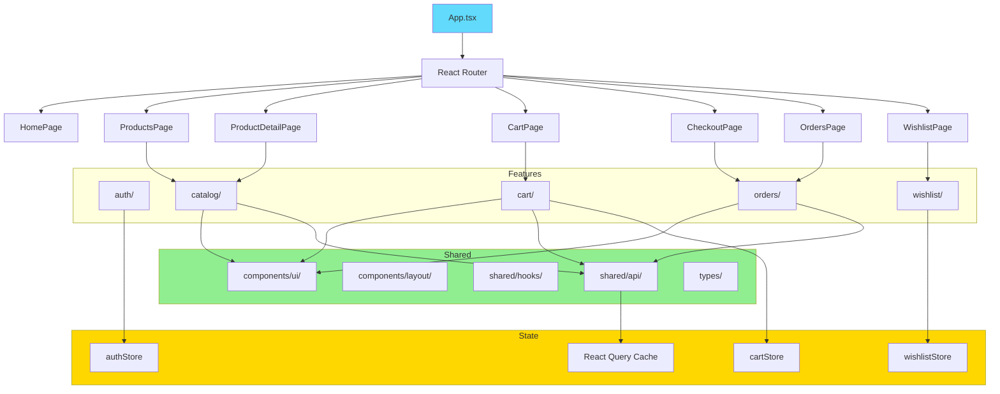
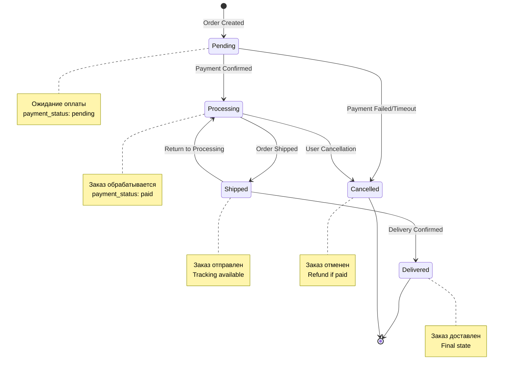
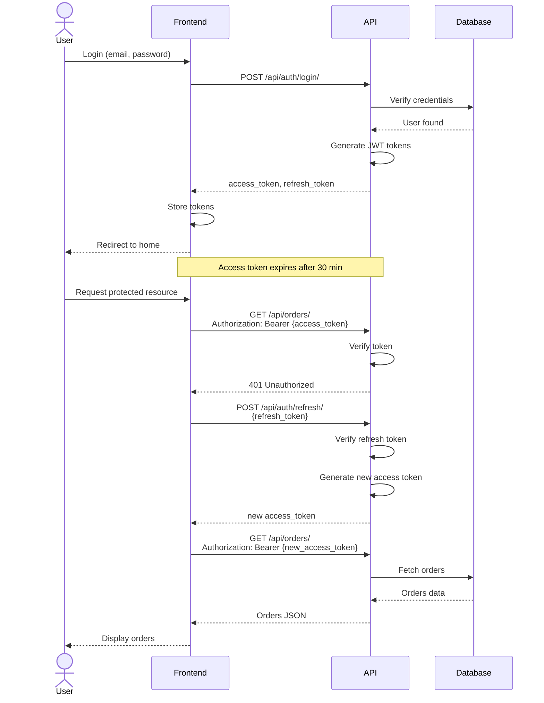
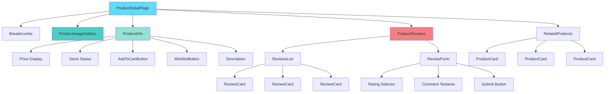
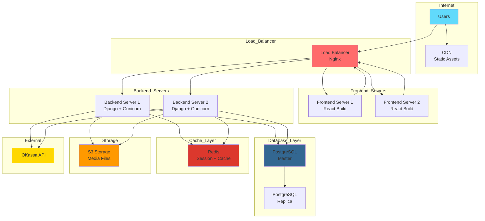

# Диаграммы архитектуры SM-Market

## 1. Структура базы данных (ER-диаграмма)

## 2. Архитектура приложения (High-level)

```mermaid
graph TB
    subgraph Client["Client Browser"]
        React["React App<br/>TypeScript + Vite"]
        Router["React Router"]
        Query["TanStack Query"]
        Zustand["Zustand Stores"]
    end
    
    subgraph Backend["Django Backend"]
        API["Django REST Framework"]
        Auth["JWT Authentication"]
        Models["Django Models"]
        Admin["Django Admin"]
    end
    
    subgraph External["External Services"]
        YooKassa["ЮKassa Payment"]
        Storage["Media Storage"]
    end
    
    subgraph Database["Database Layer"]
        Postgres["PostgreSQL"]
    end
    
    React --> Router
    React --> Query
    React --> Zustand
    
    Query -->|HTTP/REST| API
    Zustand -->|State| React
    
    API --> Auth
    API --> Models
    Models --> Postgres
    Admin --> Models
    
    API -->|Payment API| YooKassa
    YooKassa -->|Webhook| API
    
    Models -->|Images| Storage
    
    style React fill:#61dafb
    style API fill:#092e20
    style Postgres fill:#336791
    style YooKassa fill:#ffd700
```

## 3. Поток данных при покупке товара

## 4. Структура Frontend приложения

## 5. API Endpoints структура

```mermaid
graph LR
    API["/api/"]
    
    API --> Auth["/auth/"]
    API --> Products["/products/"]
    API --> Categories["/categories/"]
    API --> Cart["/cart/"]
    API --> Orders["/orders/"]
    API --> Wishlist["/wishlist/"]
    API --> Payments["/payments/"]
    
    Auth --> Login["/login/ POST"]
    Auth --> Register["/register/ POST"]
    Auth --> Refresh["/refresh/ POST"]
    Auth --> Logout["/logout/ POST"]
    
    Products --> ProductList["/GET"]
    Products --> ProductDetail["/{id}/ GET"]
    Products --> ProductReviews["/{id}/reviews/ GET,POST"]
    
    Categories --> CategoryList["/GET"]
    Categories --> CategoryProducts["/{id}/products/ GET"]
    
    Cart --> GetCart["/GET"]
    Cart --> AddItem["/items/ POST"]
    Cart --> UpdateItem["/items/{id}/ PATCH"]
    Cart --> RemoveItem["/items/{id}/ DELETE"]
    
    Orders --> CreateOrder["/POST"]
    Orders --> OrderList["/GET"]
    Orders --> OrderDetail["/{id}/ GET"]
    Orders --> CancelOrder["/{id}/cancel/ POST"]
    
    Wishlist --> GetWishlist["/GET"]
    Wishlist --> AddToWishlist["/add/ POST"]
    Wishlist --> RemoveFromWishlist["/remove/{id}/ DELETE"]
    
    Payments --> CreatePayment["/create/ POST"]
    Payments --> PaymentWebhook["/webhook/ POST"]
    Payments --> PaymentStatus["/{id}/status/ GET"]
    
    style API fill:#092e20
    style Auth fill:#ff6b6b
    style Products fill:#4ecdc4
    style Cart fill:#95e1d3
    style Orders fill:#f38181
    style Payments fill:#ffd700
```

## 6. Состояния заказа (State Machine)

## 7. Аутентификация и авторизация

## 8. Компонентная структура страницы товара

## 9. Управление состоянием корзины

```mermaid
graph TB
    User[User Action]
    
    User -->|Add to Cart| AddAction[addToCart]
    User -->|Update Quantity| UpdateAction[updateQuantity]
    User -->|Remove Item| RemoveAction[removeItem]
    User -->|Clear Cart| ClearAction[clearCart]
    
    AddAction --> CartStore[Cart Store<br/>Zustand]
    UpdateAction --> CartStore
    RemoveAction --> CartStore
    ClearAction --> CartStore
    
    CartStore -->|Sync| LocalStorage[localStorage]
    CartStore -->|Sync| API[Backend API]
    
    LocalStorage -->|Load on mount| CartStore
    API -->|Response| CartStore
    
    CartStore -->|Subscribe| CartIcon[Cart Icon<br/>Badge Count]
    CartStore -->|Subscribe| CartPage[Cart Page]
    CartStore -->|Subscribe| Checkout[Checkout Page]
    
    CartStore -->|Calculate| TotalPrice[Total Price]
    CartStore -->|Calculate| ItemCount[Items Count]
    
    style CartStore fill:#ffd700
    style LocalStorage fill:#90ee90
    style API fill:#092e20
```

## 10. Deployment архитектура

## Заключение

Эти диаграммы помогают визуализировать:
- Структуру базы данных и связи между таблицами
- Архитектуру приложения на высоком уровне
- Потоки данных при ключевых операциях
- Организацию кода frontend
- API endpoints структуру
- Состояния заказов
- Процесс аутентификации
- Компонентную структуру
- Управление состоянием
- Deployment архитектуру

Используйте эти диаграммы как справочный материал при разработке и для онбординга новых разработчиков.